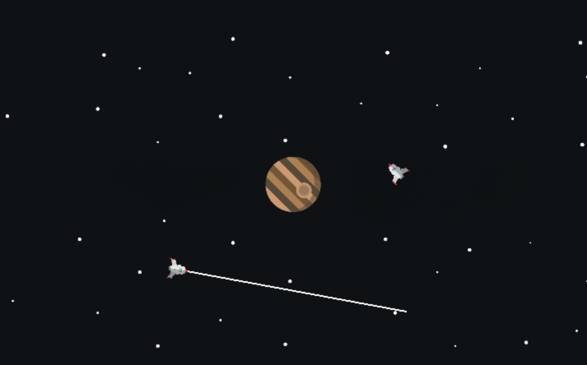

# 🚀 Gravity Simulator

A gravity simulation using Pygame where you can launch rockets and observe gravity's effect.



## 🌌 Features

- Interactive rocket launching
- Realistic gravity physics
- Collision detection with a central planet
- Custom background and rocket sprite

## 📦 Requirements

- Python 3.6+
- Pygame

Install Pygame with:

```bash
pip install pygame
```

## ▶️ Run the Simulation

Run the program from your terminal:

```bash
python gravity_simulator.py
```

## 🏃 Run with Shell Script

Alternatively, run the simulator with:

```bash
./run.sh
```

## 🧠 How to Play

1. Click once to set the rocket's initial position
2. Move your mouse to aim and set velocity
3. Click again to launch the rocket
4. Watch gravity pull it toward the central planet!

## 📁 Project Structure

```text
gravity-simulator/
├── gravity_simulator.py       # Main simulation code
├── rocket.png                 # Rocket image
├── space_background.jpg       # Background image
├── README.md                  # Project info and usage
└── screenshot.png             # (Optional) Screenshot of the simulation
```

